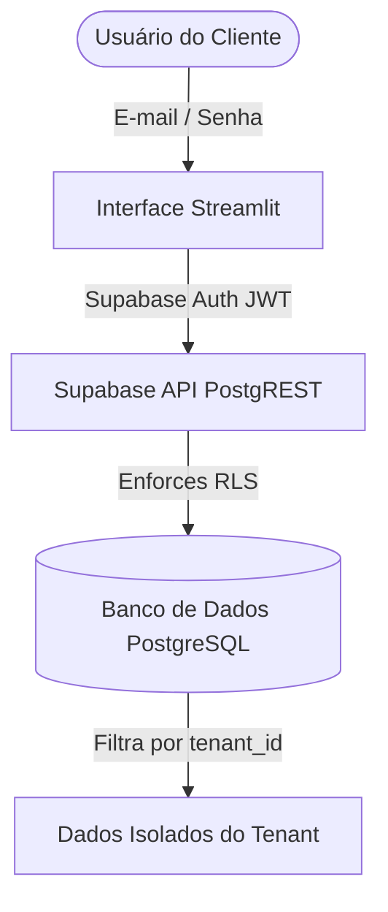

# Plano de Arquitetura SaaS Multi-Tenant - App KAN

Este documento apresenta a especificação detalhada da arquitetura multi-tenant para o aplicativo KAN (`mundokan`), garantindo isolamento absoluto de dados, controle de acessos baseado em assinatura (Básico vs. Premium), e restrições para perfis administrativos.

---

## 1. Diagnóstico e Arquitetura Geral

### Estado Atual
* **Autenticação:** Baseada em um dicionário fixo (`USUARIOS`) no arquivo `services/auth.py`.
* **Isolamento de Dados:** Inexistente no banco de dados. Tabelas como `mapas_salvos`, `equipes` e `vagas` possuem Row Level Security (RLS) habilitado no Supabase, mas com políticas genéricas de "acesso total" (`USING (true)`) ou dependentes do backend autenticado com `service_role` (que ignora RLS).
* **Níveis de Acesso:** A verificação de nível administrativo (`adminkan`) é feita por comparação de string simples no session state.

### Arquitetura Proposta
Adotaremos uma abordagem **SaaS Multi-tenant Compartilhada (Single Database, Shared Schema)** onde o isolamento de dados é garantido diretamente na camada de banco de dados do Supabase via **Row Level Security (RLS)**.



---

## 2. Modelagem no Supabase (Banco de Dados)

### A. Tabela `public.tenants`
Armazena os dados das organizações clientes e seu nível de assinatura.

```sql
CREATE TABLE IF NOT EXISTS public.tenants (
    id         UUID PRIMARY KEY DEFAULT gen_random_uuid(),
    name       TEXT NOT NULL,
    slug       TEXT UNIQUE NOT NULL,
    tier       TEXT NOT NULL CHECK (tier IN ('basic', 'premium')) DEFAULT 'basic',
    created_at TIMESTAMPTZ NOT NULL DEFAULT NOW()
);
```

### B. Tabela `public.usuarios` (Perfil dos Usuários)
Substituirá ou complementará a tabela atual para associá-la aos tenants e ao `auth.users` do Supabase.

```sql
CREATE TABLE IF NOT EXISTS public.usuarios (
    id             UUID PRIMARY KEY REFERENCES auth.users(id) ON DELETE CASCADE,
    usuario        TEXT UNIQUE NOT NULL,
    nome_completo  TEXT,
    email          TEXT UNIQUE NOT NULL,
    celular        TEXT,
    tenant_id      UUID REFERENCES public.tenants(id) ON DELETE CASCADE,
    is_main_user   BOOLEAN DEFAULT FALSE,
    direitos       TEXT DEFAULT 'Comum' CHECK (direitos IN ('Comum', 'Editor', 'Analista', 'admin master')),
    status         TEXT DEFAULT 'Ativo' CHECK (status IN ('Ativo', 'Inativo')),
    created_at     TIMESTAMPTZ DEFAULT NOW(),
    updated_at     TIMESTAMPTZ DEFAULT NOW()
);
```

### C. Tabelas de Dados Vinculadas ao `tenant_id`
Todas as tabelas que possuem dados dos clientes precisarão receber a coluna `tenant_id`:

```sql
-- 1. Equipes
ALTER TABLE public.equipes ADD COLUMN IF NOT EXISTS tenant_id UUID REFERENCES public.tenants(id) ON DELETE CASCADE;

-- 2. Vagas
ALTER TABLE public.vagas ADD COLUMN IF NOT EXISTS tenant_id UUID REFERENCES public.tenants(id) ON DELETE CASCADE;

-- 3. Processos Seletivos
ALTER TABLE public.processos_seletivos ADD COLUMN IF NOT EXISTS tenant_id UUID REFERENCES public.tenants(id) ON DELETE CASCADE;

-- 4. Mapas Salvos (Talentos)
ALTER TABLE public.mapas_salvos ADD COLUMN IF NOT EXISTS tenant_id UUID REFERENCES public.tenants(id) ON DELETE CASCADE;

-- 5. Empresas
ALTER TABLE public.empresas ADD COLUMN IF NOT EXISTS tenant_id UUID REFERENCES public.tenants(id) ON DELETE CASCADE;

-- 6. Hierarquia Departamentos
ALTER TABLE public.hierarquia_departamentos ADD COLUMN IF NOT EXISTS tenant_id UUID REFERENCES public.tenants(id) ON DELETE CASCADE;
```

---

## 3. Políticas de RLS (Row Level Security)

Para garantir segurança de ponta a ponta e que um tenant **nunca** veja o dado de outro, implementaremos políticas de segurança baseadas no ID do usuário autenticado (`auth.uid()`).

### A. Funções Auxiliares (Security Definer)

```sql
-- Função para obter o tenant_id do usuário logado
CREATE OR REPLACE FUNCTION public.get_my_tenant_id()
RETURNS UUID 
SECURITY DEFINER
AS $$
BEGIN
    RETURN (SELECT tenant_id FROM public.usuarios WHERE id = auth.uid());
END;
$$ LANGUAGE plpgsql;

-- Função para verificar se o usuário é o adminkan (admin master)
CREATE OR REPLACE FUNCTION public.is_adminkan()
RETURNS BOOLEAN 
SECURITY DEFINER
AS $$
BEGIN
    RETURN EXISTS (
        SELECT 1 FROM public.usuarios 
        WHERE id = auth.uid() AND direitos = 'admin master'
    );
END;
$$ LANGUAGE plpgsql;
```

### B. Ativação e Criação de Políticas

Habilitamos o RLS nas tabelas de dados:

```sql
ALTER TABLE public.equipes ENABLE ROW LEVEL SECURITY;
ALTER TABLE public.vagas ENABLE ROW LEVEL SECURITY;
ALTER TABLE public.processos_seletivos ENABLE ROW LEVEL SECURITY;
ALTER TABLE public.mapas_salvos ENABLE ROW LEVEL SECURITY;
ALTER TABLE public.empresas ENABLE ROW LEVEL SECURITY;
ALTER TABLE public.hierarquia_departamentos ENABLE ROW LEVEL SECURITY;
```

E aplicamos a política de isolamento. O `adminkan` tem bypass total de leitura/escrita, enquanto usuários comuns só acessam registros de seu próprio `tenant_id`:

```sql
-- Exemplo para a tabela mapas_salvos
CREATE POLICY "tenant_isolation_mapas_salvos" ON public.mapas_salvos
    FOR ALL TO authenticated
    USING (public.is_adminkan() OR tenant_id = public.get_my_tenant_id())
    WITH CHECK (public.is_adminkan() OR tenant_id = public.get_my_tenant_id());

-- Exemplo para a tabela equipes
CREATE POLICY "tenant_isolation_equipes" ON public.equipes
    FOR ALL TO authenticated
    USING (public.is_adminkan() OR tenant_id = public.get_my_tenant_id())
    WITH CHECK (public.is_adminkan() OR tenant_id = public.get_my_tenant_id());

-- Exemplo para a tabela vagas
CREATE POLICY "tenant_isolation_vagas" ON public.vagas
    FOR ALL TO authenticated
    USING (public.is_adminkan() OR tenant_id = public.get_my_tenant_id())
    WITH CHECK (public.is_adminkan() OR tenant_id = public.get_my_tenant_id());

-- Exemplo para a tabela processos_seletivos
CREATE POLICY "tenant_isolation_processos" ON public.processos_seletivos
    FOR ALL TO authenticated
    USING (public.is_adminkan() OR tenant_id = public.get_my_tenant_id())
    WITH CHECK (public.is_adminkan() OR tenant_id = public.get_my_tenant_id());
```

---

## 4. Autenticação e Sessão no Streamlit

Quando o usuário realiza o login, o Streamlit gerencia a autenticação contra o Supabase Auth. Após o login bem-sucedido, o `tenant_id` e a assinatura (`tier`) são recuperados e armazenados no `st.session_state`.

```python
# Estrutura lógica do fluxo de login em services/auth.py

def login_user_supabase(email, password):
    client = get_public_client()
    try:
        # 1. Autenticação no Supabase Auth
        res = client.auth.sign_in_with_password({"email": email, "password": password})
        
        if res.session:
            # 2. Grava sessão JWT do Supabase no Session State
            st.session_state["supabase_session"] = res.session
            st.session_state["logged_user"] = res.user.email
            st.session_state["password_correct"] = True
            
            # 3. Busca o perfil do usuário para capturar direitos e tenant_id
            user_client = get_supabase_user_client()
            user_res = user_client.table("usuarios").select("tenant_id, direitos, usuario").eq("id", res.user.id).execute()
            
            if user_res.data:
                user_info = user_res.data[0]
                st.session_state["tenant_id"] = user_info["tenant_id"]
                st.session_state["user_rights"] = user_info["direitos"]
                st.session_state["logged_user_name"] = user_info["usuario"]
                
                # 4. Busca o plano/tier do tenant correspondente
                tenant_res = user_client.table("tenants").select("tier").eq("id", user_info["tenant_id"]).execute()
                if tenant_res.data:
                    st.session_state["tenant_tier"] = tenant_res.data[0]["tier"]
                else:
                    st.session_state["tenant_tier"] = "basic" # Fallback seguro
                    
            return True, "Login efetuado com sucesso."
    except Exception as e:
        return False, str(e)
    return False, "Usuário ou senha incorretos."
```

O `st.session_state` armazenará de forma segura no lado do servidor as seguintes chaves:
* `st.session_state.tenant_id`: UUID do tenant do cliente.
* `st.session_state.tenant_tier`: `'basic'` ou `'premium'`.
* `st.session_state.user_rights`: Direitos do usuário (Ex: `'admin master'` para o `adminkan`).

---

## 5. Estrutura de Módulos Python e Injeção Automática

Refatoraremos a camada de conexão com o banco para garantir a injeção do JWT de forma limpa nas consultas.

### A. Estrutura de Arquivos Proposta
```
PROG/
├── services/
│   ├── db_client.py  <-- Novo: Centraliza a inicialização de conexões e injeção do token JWT do usuário
│   └── auth.py       <-- Modificado: Usa o Supabase Auth para login e inicializa session_state
├── models/
│   └── database.py   <-- Modificado: Atualiza consultas para usar o db_client.py (removendo bypass de admin)
└── menus/
    ├── admin_menu.py <-- Modificado: Tela de gerenciamento de tenants e usuários principais (restrita ao adminkan)
    └── app.py        <-- Modificado: Lógica de roteamento e restrições visuais do menu baseado em tenant_tier
```

### B. Injeção de Contexto no `services/db_client.py`

Este arquivo cuidará da injeção dinâmica do JWT do usuário em todas as conexões, aplicando as regras de RLS do banco:

```python
import streamlit as st
from supabase import create_client, Client

def get_public_client() -> Client:
    """Retorna um cliente padrão com a chave anon key pública."""
    url = st.secrets["connections"]["supabase"]["SUPABASE_URL"]
    key = st.secrets["connections"]["supabase"]["SUPABASE_KEY"]
    return create_client(url, key)

def get_supabase_client() -> Client:
    """
    Retorna o cliente Supabase associado ao JWT do usuário logado.
    Garante que qualquer chamada a este cliente passe o token de autenticação
    da sessão, ativando as políticas de RLS no Supabase.
    """
    client = get_public_client()
    if "supabase_session" in st.session_state:
        session = st.session_state["supabase_session"]
        client.postgrest.auth(session.access_token)
    return client

def get_supabase_admin() -> Client:
    """
    Retorna o cliente administrativo (service_role).
    DEVE ser usado apenas em tarefas de nível de sistema (Ex: criação de novos tenants e onboarding).
    """
    url = st.secrets["connections"]["supabase"]["SUPABASE_URL"]
    key = st.secrets["connections"]["supabase"]["SUPABASE_SERVICE_ROLE_KEY"]
    return create_client(url, key)
```

Na base de dados (`models/database.py`), as chamadas de CRUD serão modificadas de `get_supabase_admin()` para `get_supabase_client()`. Isso garante que as listagens filtrem as linhas pelo `tenant_id` automaticamente.

---

## 6. Restrições do Menu e Funcionalidades

### A. Roteamento e Sidebar no `app.py`
Ajustaremos a construção dos menus na barra lateral:

```python
# Em app.App.render_sidebar()
menu_groups = {
    "CADASTROS": ["Talentos", "Vagas", "Empresa e Organograma"],
    "ANÁLISES": ["Diagnósticos", "Analytics", "Processo seletivo"],
    "CONFIGURAÇÕES": ["Empresa", "Usuários"]
}

# 1. O menu "Equipes" é restrito aos tenants Premium ou ao adminkan
if st.session_state.get("tenant_tier") == "premium" or st.session_state.get("user_rights") == "admin master":
    menu_groups["CADASTROS"].append("Equipes")

# 2. O menu "Painel de Controle" (Admin) e o menu de gerenciamento de Tenants só aparecem para o adminkan
if st.session_state.get("user_rights") == "admin master":
    menu_groups["ADMIN"] = ["Painel de Controle"]
```

### B. Bloqueio da Análise de Harmonia no Processo Seletivo
No arquivo `menus/processo_seletivo_analise_menu.py`, bloquearemos a funcionalidade se o plano do usuário for `'basic'`:

```python
# Interceptador da funcionalidade de Harmonia de Equipes
is_premium = st.session_state.get("tenant_tier") == "premium" or st.session_state.get("user_rights") == "admin master"

if not is_premium:
    st.info("🔮 **Recurso Premium**")
    st.markdown("""
        O módulo de **Análise de Harmonia de Equipes** está disponível exclusivamente na versão Premium do KAN.
        
        Com a versão Premium, você poderá:
        * Analisar a compatibilidade comportamental de candidatos com equipes existentes.
        * Obter relatórios profundos sobre gaps comportamentais do grupo.
        
        Fale com nosso suporte para ativar o upgrade!
    """)
else:
    # Renderiza a aba/análise de harmonia normalmente...
    render_analise_harmonia_equipe()
```

---

## 7. Fluxo de Criação de Tenant (Pelo `adminkan`)

A criação de um novo cliente (tenant) será feita no painel `SaaS Multi-Tenant` (restrito ao `adminkan`):

1. O `adminkan` insere o **Nome da Empresa / Tenant** e seleciona o **Plano (Basic ou Premium)**.
2. O `adminkan` insere os dados do **Usuário Principal** (E-mail, Usuário e Senha).
3. O Streamlit chama uma função do `services/auth.py` rodando com o `get_supabase_admin()` (service_role):
   - Registra o usuário no Supabase Auth via Admin API (`admin.create_user`).
   - Insere o registro na tabela `public.tenants` com o plano selecionado.
   - Associa o novo usuário ao `tenant_id` na tabela `public.usuarios` marcando `is_main_user = TRUE` e `direitos = 'Comum'` (ou conforme necessário).
4. O cliente já poderá entrar com seu e-mail e senha diretamente na tela de login, herdando as restrições corretas do tenant automaticamente.
